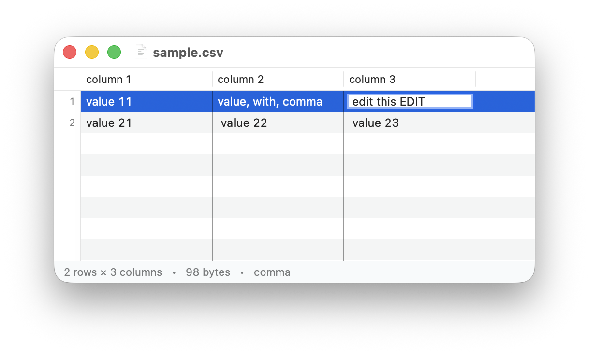

# csvedit

A fast, native macOS CSV editor. Opens gigabyte files instantly.



## Install

```sh
brew install --cask timurgaitov/tap/csvedit
```

The app isn't notarized yet — if macOS blocks the first launch, right-click
the app in Finder and choose **Open**.

Or build from source (requires only the Xcode command line tools):

```sh
./build.sh && open build/csvedit.app
```
